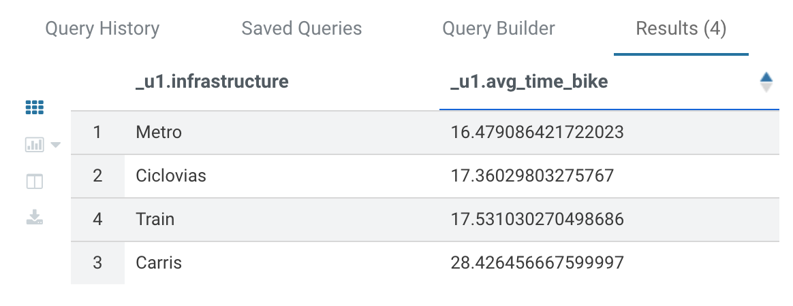
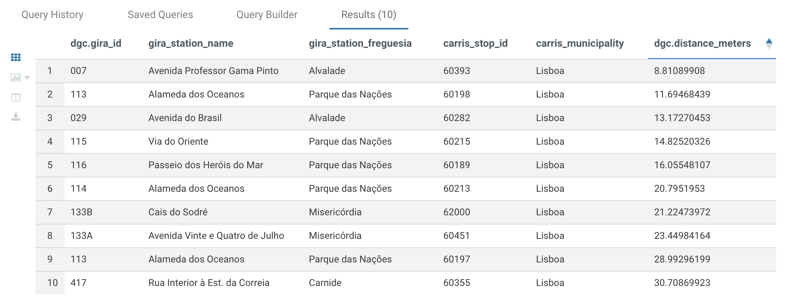
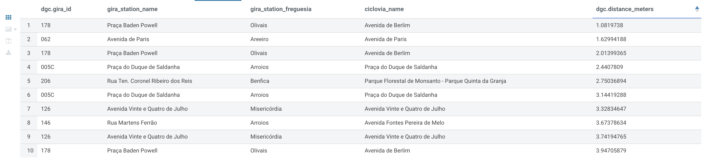
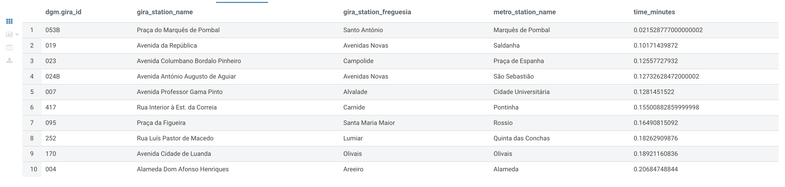

# Gira Bikes Lisbon

[](README.md)
[](README.en.md)

A study on the integration of Gira bike stations with Lisbon’s public transport network, including bike lanes, bus stops, and Metro and Train stations.

The main idea is to determine whether the Gira stations are integrated and can help complement the existing public transport network by conducting studies on the distance and time between Gira stations and bike lanes, bus stops, Metro, and Train stations.

## Context

Work conducted for the Advanced Distributed Databases course in the [Master's in Data Science](https://iscte-iul.pt/curso/codigo/0329/mestrado-ciencia-de-dados) program at ISCTE - Instituto Universitário de Lisboa.

In the context of integrating Gira bike stations with Lisbon's public transport network, we deal with large volumes of data that can grow continuously, as public transport stations and bike lanes can always be expanded in the future.

Given this premise, we decided to use the Hadoop stack based on Docker containers, referenced in the project [docker-hadoop-hive-parquet](https://github.com/tech4242/docker-hadoop-hive-parquet) and the article "[Making big moves in Big Data with Hadoop, Hive, Parquet, Hue and Docker](https://towardsdatascience.com/making-big-moves-in-big-data-with-hadoop-hive-parquet-hue-and-docker-320a52ca175)". We believe this is the right choice because Hadoop enables working with distributed storage and large volumes of data, especially as our data can change in size and nature over time.

Next, since we aim to study the connection between the GIRA network and Lisbon's public transport network through their distances and travel times, we need to calculate distances between our datasets. This calculation was performed using a Postgres database with PostGIS. PostGIS was used because it allows for the analysis of geospatial data and coordinates in relational data, which is relevant for our case given the longitude and latitude coordinates, enabling us to relate our datasets in this way. This makes it more appealing to us than MySQL.

With the data stored in Hadoop and the distances calculated, the next step is to use Hive. In our opinion, Hive is an excellent option as it facilitates querying data stored in HDFS (Hadoop Distributed File Systems) using SQL-like queries. This gives us access to our information, allowing us to analyze it and draw conclusions related to the objective of the study.

Between Hive and HDFS, we use MapReduce and YARN, which are part of Hadoop. MapReduce is important because it is ideal for processing-intensive tasks, which helps with query calculations to determine the distances between GIRA stations and other transport stations or bike lane points. YARN, on the other hand, manages Hadoop's resources and ensures that the MapReduce application runs more efficiently.

Finally, the use of Hue became essential as it is a user-friendly interface that simplifies the process of querying and interacting with the data. Through Hue, we can interact with Hadoop, HDFS, and Hive more easily, and it also enabled the visualization of queries in tables and graphs. This proved to be an excellent tool for drawing conclusions and addressing the final question of whether the integration of GIRA into Lisbon's public transport network is a success.

# 1) Datasets Preparation

To develop this study, it was necessary to use datasets from different sources, such as:

1) [Dados.gov](https://dados.gov.pt/pt/) - Open platform for Portuguese public data.
   - [GIRA - Lisbon Bicycles](https://dados.gov.pt/pt/datasets/gira-bicicletas-de-lisboa/): Data about Gira stations, including location, status, and capacity.

2) [Geodados CML](https://geodados-cml.hub.arcgis.com/) - Open georeferenced data platform from the Lisbon City Council.
   - [POI Transportes](https://geodados-cml.hub.arcgis.com/maps/4933d8f832474ad2bff558cae59c5207/about): Map service indicating major transport stations, ferry terminals, elevators, funiculars, Mobi E charging stations in Lisbon, and Low Emission Zones.
     - [Train Stations](https://geodados-cml.hub.arcgis.com/datasets/CML::poitransportes?layer=0): Data about train stations, including location and name.
     - [Metro Stations](https://geodados-cml.hub.arcgis.com/datasets/CML::poitransportes?layer=1): Data about metro stations, including location and name.
   - [POI Mobility](https://geodados-cml.hub.arcgis.com/maps/440b7424a6284e0b9bf11179b95bf8d1/about): Map service for Lisbon's mobility zones.
     - [Cycling Network](https://geodados-cml.hub.arcgis.com/datasets/CML::ciclovias-2/explore?layer=0): Data about bike lanes, including location and name.

3) [Carris Metropolitana API](https://github.com/carrismetropolitana/api) - An open-source service providing network information in JSON or Protocol Buffers format. This service reads and converts the official GTFS file from Carris Metropolitana.
   - [Bus Stops](https://github.com/carrismetropolitana/api?tab=readme-ov-file#stops): Provides static information for all Carris bus stops, as well as associated lines, routes, and patterns for each stop.


## 1.1) Auxiliary Tools

To facilitate the import and subsequent preparation of the datasets, a Postgres database with [PostGIS](https://postgis.net/) was used.

This database was created in a Docker container to simplify its execution and usage, and it can be found in the `postgres` folder.

To run the Docker container, navigate to the `postgres` folder and execute the following command:

```sh
docker compose up -d
```

The Postgres database allows the import of all datasets from various sources, formats, and structures into a unified format.

Subsequently, with the help of the PostGIS extension, distance calculations between points of interest will be performed, followed by exporting the data to CSV files.

## 1.2) Dataset Import

The datasets were downloaded from the sources mentioned above and stored in the `dataset` folder, as follows:

- [ciclovias.geojson](dataset/ciclovias.geojson) - Data about Lisbon's bike lanes.
- [estacoes-comboios.csv](dataset/estacoes-comboios.csv) - Data about Lisbon's train stations.
- [estacoes-gira.csv](dataset/estacoes-gira.csv) - Data about Lisbon's Gira stations.
- [estacoes-metro.csv](dataset/estacoes-metro.csv) - Data about Lisbon's metro stations.

> To execute the scripts below, you must be in the `dataset` directory.

The bus stop data was obtained through the Carris Metropolitana REST API and inserted directly into the Postgres database by running the Python script:

```sh
python3 import-carris-stops.py
```

All other CSV and GeoJSON files were imported into the Postgres database by executing their respective Python scripts:

**Extract bike lanes from GeoJSON to CSV:**
```sh
python3 extract-ciclovias-geojson.py
```

**Import bike lanes from CSV to Postgres:**
```sh
python3 import-ciclovias.py
```

**Import Gira stations from CSV to Postgres:**
```sh
python3 import-gira-stations.py
```

**Import metro stations from CSV to Postgres:**
```sh
python3 import-metro-stations.py
```

**Import train stations from CSV to Postgres:**
```sh
python3 import-train-stations.py
```

At the end of this process, all dataset data were successfully imported into the Postgres database and are ready to be used. The image below summarizes the relationships between the imported data.


## 1.3) Distance Calculation

Once the data has been imported into the Postgres database, it is necessary to calculate the distance between points of interest.

The image below illustrates the calculation needed to determine the distance—in meters—between Gira stations and public transport points.


> To execute the scripts below, you must be in the `dataset` directory.

To calculate the distances between Gira stations and public transport points, a Python script was created and should be executed as follows:

```sh
python3 calculate-distances.py
```

The script above will create distance tables in Postgres and calculate the distance in meters between Gira stations and all other public transport points.

## 1.4) Exporting Data to CSV Files

Once all data has been imported and distances calculated, it is necessary to export all data to CSV files so they can be imported into Hadoop.

> To execute the scripts below, you must be in the `exported` directory.

To export all data from the Postgres database to CSV files, a Python script was created and should be executed as follows:

```sh
python3 export-postgres-to-csv.py
```

At the end of this process, all imported and calculated data in the Postgres database were exported to CSV files and are ready to be imported into Hadoop.

The image below illustrates the process of importing and preparing the datasets:


# 2) Hadoop

The Hadoop stack used in this project is based on Docker containers, as referenced in the project [docker-hadoop-hive-parquet](https://github.com/tech4242/docker-hadoop-hive-parquet) and the article "[Making big moves in Big Data with Hadoop, Hive, Parquet, Hue and Docker](https://towardsdatascience.com/making-big-moves-in-big-data-with-hadoop-hive-parquet-hue-and-docker-320a52ca175)".


## 2.1) Accessing Hue and Creating an Admin User

The first step is to access Hue, a graphical interface for Hadoop, and create an Admin user, as suggested in the scope of this project.

Open [http://localhost:8888/](http://localhost:8888/) and create a user `admin` with the password `admin`.

## 2.2) Copying Datasets to HDFS Using Docker Commands

**Navigate to the `hadoop` directory**:

```shell
cd hadoop
```

**Create `/datasets` directory in HDFS**

```shell
docker exec hadoop-namenode-1 /bin/bash hdfs dfs -mkdir /datasets
```

**Copy final datasets to the Docker container**

```shell
docker cp ../dataset/exported/ hadoop-namenode-1:/
```

**Insert datasets in the Hadoop filesystem (HDFS)**

```shell
docker exec hadoop-namenode-1 /bin/bash hdfs dfs -put /exported /datasets
```
The image below illustrates what happens when the above commands are executed.


### 2.2.1) Alternative: Copying Datasets to HDFS Using Hue

Alternatively, the datasets can be uploaded to HDFS via the Hue graphical interface, which, for this project, is available at [http://localhost:8888/](http://localhost:8888/).

The image below illustrates the process of uploading datasets to HDFS through Hue.


## 2.3) Creating Tables in Hive Using Hue

We will assume that a database named `default` has already been created.

Additionally, we will assume that the CSV files are located in the path `/datasets/exported/`, as executed in step 2.2.

```sql
CREATE TABLE gira_stations (
    object_id STRING,
    id_p STRING,
    id_c INT,
    cod_via INT,
    nome_rua STRING,
    ponto_referencia STRING,
    freguesia STRING,
    situacao STRING,
    implantacao STRING,
    global_id STRING,
    lon DOUBLE,
    lat DOUBLE,
    location STRING
)
ROW FORMAT DELIMITED
FIELDS TERMINATED BY ','
STORED AS TEXTFILE
TBLPROPERTIES ("skip.header.line.count"="1");

LOAD DATA INPATH '/datasets/exported/gira_stations.csv' INTO TABLE gira_stations;
```

```sql
CREATE TABLE metro_stations (
    object_id INT,
    cod_sig INT,
    id_tipo INT,
    nome STRING,
    situacao STRING,
    linha STRING,
    global_id STRING,
    lon DOUBLE,
    lat DOUBLE,
    location STRING
)
ROW FORMAT DELIMITED
FIELDS TERMINATED BY ','
STORED AS TEXTFILE
TBLPROPERTIES ("skip.header.line.count"="1");

LOAD DATA INPATH '/datasets/exported/metro_stations.csv' INTO TABLE metro_stations;
```

```sql
CREATE TABLE train_stations (
    object_id INT,
    cod_sig INT,
    id_tipo INT,
    id INT,
    nome STRING,
    global_id STRING,
    lon DOUBLE,
    lat DOUBLE,
    location STRING
)
ROW FORMAT DELIMITED
FIELDS TERMINATED BY ','
STORED AS TEXTFILE
TBLPROPERTIES ("skip.header.line.count"="1");

LOAD DATA INPATH '/datasets/exported/train_stations.csv' INTO TABLE train_stations;
```

```sql
CREATE TABLE carris_stops (
    id INT,
    district_id INT,
    district_name STRING,
    locality STRING,
    municipality_id INT,
    municipality_name STRING,
    operational_status STRING,
    region_id STRING,
    region_name STRING,
    stop_id INT,
    lat DOUBLE,
    lon DOUBLE,
    location STRING
)
ROW FORMAT DELIMITED
FIELDS TERMINATED BY ','
STORED AS TEXTFILE
TBLPROPERTIES ("skip.header.line.count"="1");

LOAD DATA INPATH '/datasets/exported/carris_stops.csv' INTO TABLE carris_stops;
```

```sql
CREATE TABLE distances_gira_metro (
    gira_id STRING,
    gira_nome_rua STRING,
    gira_freguesia STRING,
    metro_id INT,
    metro_nome STRING,
    distance_meters DOUBLE
)
ROW FORMAT DELIMITED
FIELDS TERMINATED BY ','
STORED AS TEXTFILE
TBLPROPERTIES ("skip.header.line.count"="1");

LOAD DATA INPATH '/datasets/exported/distances_gira_metro.csv' INTO TABLE distances_gira_metro;
```

```sql
CREATE TABLE distances_gira_stops (
    gira_id STRING,
    gira_nome_rua STRING,
    gira_freguesia STRING,
    stops_id INT,
    stop_municipality_name STRING,
    distance_meters DOUBLE
)
ROW FORMAT DELIMITED
FIELDS TERMINATED BY ','
STORED AS TEXTFILE
TBLPROPERTIES ("skip.header.line.count"="1");

LOAD DATA INPATH '/datasets/exported/distances_gira_stops.csv' INTO TABLE distances_gira_stops;
```

```sql
CREATE TABLE distances_gira_train (
    gira_id STRING,
    gira_nome_rua STRING,
    gira_freguesia STRING,
    train_id INT,
    train_nome STRING,
    distance_meters DOUBLE
)
ROW FORMAT DELIMITED
FIELDS TERMINATED BY ','
STORED AS TEXTFILE
TBLPROPERTIES ("skip.header.line.count"="1");

LOAD DATA INPATH '/datasets/exported/distances_gira_train.csv' INTO TABLE distances_gira_train;
```

```sql
CREATE TABLE ciclovias_pontos (
    ciclovia_id STRING,
    lat DOUBLE,
    lon DOUBLE,
    location STRING
)
ROW FORMAT DELIMITED
FIELDS TERMINATED BY ','
STORED AS TEXTFILE
TBLPROPERTIES ("skip.header.line.count"="1");

LOAD DATA INPATH '/datasets/exported/ciclovias_pontos.csv' INTO TABLE ciclovias_pontos;
```

```sql
CREATE TABLE ciclovias (
    ciclovia_id STRING,
    objectid STRING,
    cod_sig STRING,
    cod_via STRING,
    cod_ciclovia STRING,
    designacao STRING,
    nome_projeto STRING,
    hierarquia STRING,
    eixo STRING,
    tipologia STRING,
    nivel_segregacao STRING,
    tipo_intervencao STRING,
    situacao STRING,
    ano STRING,
    entidade_resp STRING,
    freguesia STRING,
    comprimento DOUBLE,
    comp_km DOUBLE,
    idtipo STRING,
    zonamento STRING,
    globalid STRING
)
ROW FORMAT DELIMITED
FIELDS TERMINATED BY ','
STORED AS TEXTFILE
TBLPROPERTIES ("skip.header.line.count"="1");

LOAD DATA INPATH '/datasets/exported/ciclovias.csv' INTO TABLE ciclovias;
```

```sql
CREATE TABLE distances_gira_ciclovias_pontos (
    gira_id STRING,
    ciclovia_id STRING,
    distance_meters DOUBLE
)
ROW FORMAT DELIMITED
FIELDS TERMINATED BY ','
STORED AS TEXTFILE
TBLPROPERTIES ("skip.header.line.count"="1");

LOAD DATA INPATH '/datasets/exported/distances_gira_ciclovias_pontos.csv' INTO TABLE distances_gira_ciclovias_pontos;
```

# 3) Results

To answer the main question of this project, we need to study the connection between Lisbon's GIRA network and other public transport infrastructures, specifically the Carris network, Metro, Train, and bike lanes.

To achieve this, we executed several queries in Hive using the Hue interface.

The queries that we found to be most explanatory for our initial question focused on the distance and time relationships between the datasets.

## 3.1) Executing Queries in Hive

Data analysis will be conducted through queries in Hive using HiveQL as the query language.

The execution of these queries can be done directly on the Hive Server via Docker or using data visualization tools like Hue.

### 3.1.1) Executing Queries in Hive with the Hue Interface

The image below illustrates the execution of a query in Hive using Hue.


In the example above, the query is executed within the Hue interface, using the Query Editor available at [http://localhost:8888/](http://localhost:8888/).

1. **Step 1:** The query is written in the Hue Query Editor and submitted for execution.
2. **Step 2:** Hue sends the query to the Hive Server for execution.
3. **Step 3:** Hive translates the HiveQL query into MapReduce jobs.
4. **Steps 4 and 5:** The MapReduce jobs read the data from HDFS, process it, and consolidate the results. During this process, YARN manages computational resources and oversees the execution of the MapReduce jobs.
5. **Step 6:** The results of the MapReduce job are returned to Hive, which presents them to the user in the Hue interface.

### 3.1.2) Executing Queries in Hive with Docker

The image below illustrates the execution of a query in Hive directly on the Hive Server via Docker.


Similar to the process described in section 3.1.1, the query is executed directly on the Hive Server through the Docker container.

**To enter inside Hive Server's container:**
```shell
docker exec -it hadoop-hive-server-1 hive
```

In **Step 1**, the query is written and executed on the Hive Server.

In **Step 2**, Hive translates the query written in HiveQL into MapReduce jobs.

In **Steps 3 and 4**, the MapReduce job reads data from HDFS, processes it, and consolidates the results. During this process, YARN allocates computational resources and manages the execution of the MapReduce jobs.

Finally, the results of the MapReduce job are returned to Hive, which presents them as output to the user.

## 3.2) Data Analysis

### Average Distance: GIRA – Infrastructures

```sql
SELECT
    'Carris' AS infra_structure, AVG(distance_meters) AS avg_distance
FROM distances_gira_stops s
UNION ALL
SELECT
    'Ciclovias', AVG(distance_meters)
FROM distances_gira_ciclovias_pontos
UNION ALL
SELECT
    'Metro', AVG(distance_meters)
FROM distances_gira_metro
UNION ALL
SELECT
    'Train', AVG(distance_meters)
FROM distances_gira_train;
```


### Average Time: GIRA – Infrastructures

```sql
SELECT
    'Carris' AS infrastructure, AVG(distance_meters / 250) AS avg_time_bike
FROM distances_gira_stops
UNION ALL
SELECT
    'Ciclovias', AVG(distance_meters / 250)
FROM distances_gira_ciclovias_pontos
UNION ALL
SELECT
    'Metro', AVG(distance_meters / 250)
FROM distances_gira_metro
UNION ALL
SELECT
    'Train', AVG(distance_meters / 250)
FROM distances_gira_train;
```



### Top 10 GIRA Stations Closest to Carris Bus Stops

```sql
SELECT
    dgc.gira_id,
    g.nome_rua AS gira_station_name,
    g.freguesia AS gira_station_freguesia,
    c.stop_id AS carris_stop_id,
    c.municipality_name AS carris_municipality,
    dgc.distance_meters
FROM distances_gira_stops dgc
JOIN gira_stations g ON dgc.gira_id = g.object_id
JOIN carris_stops c ON dgc.stops_id = c.stop_id
GROUP BY dgc.gira_id, g.nome_rua, g.freguesia, c.stop_id, c.municipality_name, dgc.distance_meters
ORDER BY dgc.distance_meters
LIMIT 10;
```



### Top 10 GIRA Stations Closest to Metro Stations

```sql
SELECT
    dgm.gira_id,
    g.nome_rua AS gira_station_name,
    g.freguesia AS gira_station_freguesia,
    m.nome AS metro_station_name,
    dgm.distance_meters
FROM distances_gira_metro dgm
JOIN gira_stations g ON dgm.gira_id = g.object_id
JOIN metro_stations m ON dgm.metro_id = m.object_id
GROUP BY dgm.gira_id, g.nome_rua, g.freguesia, m.nome, dgm.distance_meters
ORDER BY dgm.distance_meters
LIMIT 10;
```


### Top 10 GIRA Stations Closest to Train Stations

```sql
SELECT
    dgt.gira_id,
    g.nome_rua AS gira_station_name,
    g.freguesia AS gira_station_freguesia,
    t.nome AS train_station_name,
    dgt.distance_meters
FROM distances_gira_train dgt
JOIN gira_stations g ON dgt.gira_id = g.object_id
JOIN train_stations t ON dgt.train_id = t.object_id
GROUP BY dgt.gira_id, g.nome_rua, g.freguesia, t.nome, dgt.distance_meters
ORDER BY dgt.distance_meters
LIMIT 10;
```


### Top 10 GIRA Stations Closest to Bike Lanes

```sql
SELECT
    dgc.gira_id,
    g.nome_rua AS gira_station_name,
    g.freguesia AS gira_station_freguesia,
    c.designacao AS ciclovia_name,
    dgc.distance_meters
FROM distances_gira_ciclovias_pontos dgc
JOIN gira_stations g ON dgc.gira_id = g.object_id
JOIN ciclovias c ON dgc.ciclovia_id = c.ciclovia_id
GROUP BY dgc.gira_id, g.nome_rua, g.freguesia, c.designacao, dgc.distance_meters
ORDER BY dgc.distance_meters
LIMIT 10;
```



### Top 10 GIRA Stations with the Shortest Travel Time to Carris Bus Stops

```sql
SELECT
    dgc.gira_id,
    g.nome_rua AS gira_station_name,
    g.freguesia AS gira_station_freguesia,
    c.stop_id AS carris_stop_id,
    c.municipality_name AS carris_municipality,
    (dgc.distance_meters / 250) AS time_minutes
FROM distances_gira_stops dgc
JOIN gira_stations g ON dgc.gira_id = g.object_id
JOIN carris_stops c ON dgc.stops_id = c.stop_id
GROUP BY dgc.gira_id, g.nome_rua, g.freguesia, c.stop_id, c.municipality_name, dgc.distance_meters
ORDER BY time_minutes
LIMIT 10;
```


### Top 10 GIRA Stations with the Shortest Travel Time to Metro Stations

```sql
SELECT
    dgm.gira_id,
    g.nome_rua AS gira_station_name,
    g.freguesia AS gira_station_freguesia,
    m.nome AS metro_station_name,
    (dgm.distance_meters / 250) AS time_minutes
FROM distances_gira_metro dgm
JOIN gira_stations g ON dgm.gira_id = g.object_id
JOIN metro_stations m ON dgm.metro_id = m.object_id
GROUP BY dgm.gira_id, g.nome_rua, g.freguesia, m.nome, dgm.distance_meters
ORDER BY time_minutes
LIMIT 10;
```



### Top 10 GIRA Stations with the Shortest Travel Time to Train Stations

```sql
SELECT
    dgt.gira_id,
    g.nome_rua AS gira_station_name,
    g.freguesia AS gira_station_freguesia,
    t.nome AS train_station_name,
    (dgt.distance_meters / 250) AS time_minutes
FROM distances_gira_train dgt
JOIN gira_stations g ON dgt.gira_id = g.object_id
JOIN train_stations t ON dgt.train_id = t.object_id
GROUP BY dgt.gira_id, g.nome_rua, g.freguesia, t.nome, dgt.distance_meters
ORDER BY time_minutes
LIMIT 10;
```


### Top 10 GIRA Stations with the Shortest Travel Time to Bike Lanes

```sql
SELECT
    dgc.gira_id,
    g.nome_rua AS gira_station_name,
    g.freguesia AS gira_station_freguesia,
    c.designacao AS ciclovia_name,
    (dgc.distance_meters / 250) AS time_minutes
FROM distances_gira_ciclovias_pontos dgc
JOIN gira_stations g ON dgc.gira_id = g.object_id
JOIN ciclovias c ON dgc.ciclovia_id = c.ciclovia_id
GROUP BY dgc.gira_id, g.nome_rua, g.freguesia, c.designacao, dgc.distance_meters
ORDER BY time_minutes
LIMIT 10;
```


### Minimum Distance: GIRA – Carris by District

```sql
SELECT
    g.freguesia,
    MIN(dgc.distance_meters) AS min_distance_gira_carris
FROM gira_stations g
JOIN distances_gira_stops dgc ON g.object_id = dgc.gira_id
GROUP BY g.freguesia
ORDER BY min_distance_gira_carris ASC;
```


### Minimum Distance: GIRA – Metro by District

```sql
SELECT
    g.freguesia,
    MIN(dgm.distance_meters) AS min_distance_gira_metro
FROM gira_stations g
JOIN distances_gira_metro dgm ON g.object_id = dgm.gira_id
GROUP BY g.freguesia
ORDER BY min_distance_gira_metro ASC;
```


### Minimum Distance: GIRA – Train Stations by District

```sql
SELECT
    g.freguesia,
    MIN(dgt.distance_meters) AS min_distance_gira_train
FROM gira_stations g
JOIN distances_gira_train dgt ON g.object_id = dgt.gira_id
GROUP BY g.freguesia
ORDER BY min_distance_gira_train ASC;
```


### Minimum Distance: GIRA – Bike Lanes by District

```sql
SELECT
    g.freguesia,
    AVG(dcp.distance_meters) AS avg_distance_gira_ciclovias
FROM gira_stations g
JOIN distances_gira_ciclovias_pontos dcp ON g.object_id = dcp.gira_id
GROUP BY g.freguesia
ORDER BY avg_distance_gira_ciclovias ASC;
```


# 4) Conclusion

Based on the results obtained, we can conclude that the GIRA network is well integrated with Lisbon's public transport network and bike lanes.

On average, any metro station, train station, or bike lane is approximately 4 km away from a GIRA station. At an average cycling speed of 15 km/h on a GIRA bike, this distance translates to about 17 minutes of travel time.

Regarding the minimum distances, there are 10 GIRA stations located:
- 30 meters or less from a bus stop,
- 50 meters or less from a metro station,
- 200 meters or less from a train station,
- and 4 meters or less from a bike lane.

All the distances mentioned above correspond to travel times of less than 1 minute on a GIRA bike traveling at 15 km/h.

Looking more broadly, not at individual GIRA stations but by districts within Lisbon:
- 18 out of 22 districts have a bus stop within 500 meters of a GIRA station,
- 16 districts have a metro station within 300 meters,
- 18 districts have a train station within 1 km,
- and all 22 districts have a bike lane within 300 meters of a GIRA station.

Based on the data collected and our research, the GIRA network can be considered an excellent complement to Lisbon's public transport network and bike lanes.
