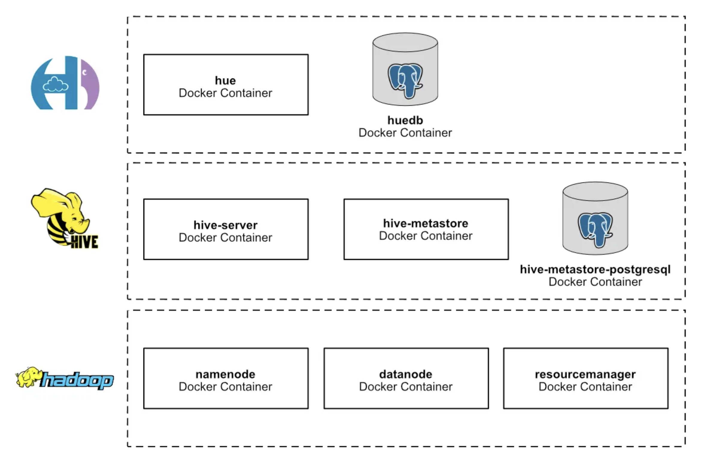

# Gira Bikes Lisbon

Um estudo sobre a relação da integração das estações de bicicletas Gira com a rede de transporte público de Lisboa, incluindo ciclovias, paragens de autocarro e estações de Metro e Comboios.

## Contexto

Trabalho realizado para a disciplina de Bases de Dados Distribuidas Avançadas no [Mestrado em Ciência de Dados](https://iscte-iul.pt/curso/codigo/0329/mestrado-ciencia-de-dados) do ISCTE - Istituto Universitário de Lisboa.


# Provedores dos Datasets

- Dados.gov
  - [GIRA - Bicicletas de Lisboa](https://dados.gov.pt/pt/datasets/gira-bicicletas-de-lisboa/): Dados sobre as estações Gira, incluindo localização, estado e capacidade.
- Geodados CML
  - [POI Transportes](https://geodados-cml.hub.arcgis.com/maps/4933d8f832474ad2bff558cae59c5207/about)
    - [Estações de Comboio](https://geodados-cml.hub.arcgis.com/datasets/CML::poitransportes?layer=0): Dados sobre as estações de comboio, incluindo localização e nome.
    - [Estações de Metro](https://geodados-cml.hub.arcgis.com/datasets/CML::poitransportes?layer=1): Dados sobre as estações de metro, incluindo localização e nome.
  - [POI Mobilidade](https://geodados-cml.hub.arcgis.com/maps/440b7424a6284e0b9bf11179b95bf8d1/about)
    - [Rede Ciclável](https://geodados-cml.hub.arcgis.com/datasets/CML::ciclovias-2/explore?layer=0): Dados sobre as ciclovias, incluindo localização e nome.
- [Carris Metropolitana API](https://github.com/carrismetropolitana/api)
  - [Paragens de Autocarro](https://api.carrismetropolitana.pt/stops): Dados sobre as paragens de autocarro, incluindo localização e nome.

# Ferramentas auxiliares

## Postgres DB com PostGIS

A base de dados Postgres com a extensão [PostGIS](https://postgis.net/) vai auxiliar no cálculo da distância entre os pontos que se quer relacionar, por exemplo:

- Distância entre estações Gira e:
  - Ciclovias
  - Paragens de autocarro
  - Estações de metro
  - Estações de comboios

## Docker

Usaremos contentores Docker para facilitar/automatizar o trabalho, neste caso iremos ter ferramentas auxiliares como:
- Postgres DB com extensão PostGIS
- Scripts de importação/exportação com Python

Para executar o docker:

```sh
cd postgres
docker compose up -d
```

## Explicação

Pelo facto de termos diferentes provedores de datasets, com diferentes formatos e estruturas, é necessário ter scripts python que irão auxiliar na importação dos dados para a base de dados Postgres com extensão PostGIS.

Por exemplo, as estações de comboio, metro, Gira e ciclovias são fornecidas em CSV ou GeoJSON, e os scripts python irão importar esses dados para a base de dados Postgres seguindo um único formato.

Por outro lado, as paragens de autocarro são fornecidas através de uma API REST, e os scripts python irão fazer chamadas a essa API e importar os dados para a base de dados Postgres seguindo o mesmo formato.

Após a importação dos dados, é necessário calcular a distância entre os pontos de interesse, por exemplo, a distância entre as estações Gira e as paragens de autocarro, ou a distância entre as estações Gira e as estações de comboio, entre outras.

Finalmente, após o cálculo das distâncias, é necessário exportar os dados para arquivos CSV, para que possam ser importados para o Hadoop.


# Dataset

## Fazer Setup Inicial com Importações

É necessário estar na pasta `dataset` para executar os passos abaixo.

### 1. Criar tabelas no Postgres

Para criar as tabelas na base de dados Postgres, foi criado um script python que deve ser executado como no exemplo:

```sh
python3 create-tables.py
```

### 2. Importar Paragens de autocarro

Para importar as paragens de autocarro para a base de dados Postgres, foi criado um script python que deve ser executado como no exemplo:

```sh
python3 import-carris-stops.py
```

### 3. Importar Estações de Comboios

Para importar as estações de comboios para a base de dados Postgres, foi criado um script python que deve ser executado como no exemplo:

```sh
python3 import-train-stations.py
```

### 4. Importar Estações de Metro

Para importar as estações de metro para a base de dados Postgres, foi criado um script python que deve ser executado como no exemplo:

```sh
python3 import-metro-stations.py
```

### 5. Importar Estações Gira

Para importar as estações gira para a base de dados Postgres, foi criado um script python que deve ser executado como no exemplo:

```sh
python3 import-gira-stations.py
```

### 6. Importar Ciclovias

Para importar as ciclovias para a base de dados Postgres, foi criado um script python que deve ser executado como no exemplo:

```sh
python3 import-ciclovias.py
```

### 6. Calcular distâncias entre os pontos de interesse

Para calcular as distâncias entre as estações gira e os pontos de transporte público e importar para a base de dados Postgres, foi criado um script python que deve ser executado como no exemplo:

```sh
python3 calculate-distances.py
```

## Exportar todos os dados Postgres para CSV

Uma vez que os dados foram importados e calculados, para exportar tudo para arquivos CSV é preciso executar o script python como no exemplo abaixo.

É necessário estar na pasta `dataset/exported` para executar o script.

```sh
python3 export-postgres-to-csv.py
```

# Hadoop

A stack Hadoop utilizada neste trabalho será baseada em contentores Docker, referenciados no projeto [docker-hadoop-hive-parquet](https://github.com/tech4242/docker-hadoop-hive-parquet) e no artigo "[Making big moves in Big Data with Hadoop, Hive, Parquet, Hue and Docker](https://towardsdatascience.com/making-big-moves-in-big-data-with-hadoop-hive-parquet-hue-and-docker-320a52ca175)".



## Copiar datasets para o HDFS

TODO: detalhar os comandos abaixo

```shell
cd hadoop
docker exec hadoop-namenode-1 /bin/bash hdfs dfs -mkdir /datasets
docker cp ../dataset/exported/ hadoop-namenode-1:/
docker exec hadoop-namenode-1 /bin/bash hdfs dfs -put /exported /datasets
```

## Aceder ao Hue e criar user Admin

Abrir http://localhost:8888/ e criar um user `admin` com password `admin`.

## Criar tabelas com Hue

Vamos assumir que temos criado uma Base de dados chamada `default`.

Além disso, vamos assumir que os arquivos CSV estarão presentes no path: `/datasets/exported/`.

## Criar tabelas com Hue, no stack Hadoop

```
CREATE TABLE gira_stations (
    object_id STRING,
    id_p STRING,
    id_c INT,
    cod_via INT,
    nome_rua STRING,
    ponto_referencia STRING,
    freguesia STRING,
    situacao STRING,
    implantacao STRING,
    global_id STRING,
    lon DOUBLE,
    lat DOUBLE,
    location STRING
)
ROW FORMAT DELIMITED
FIELDS TERMINATED BY ','
STORED AS TEXTFILE
TBLPROPERTIES ("skip.header.line.count"="1");

LOAD DATA INPATH '/datasets/exported/gira_stations.csv' INTO TABLE gira_stations;
```

```
CREATE TABLE metro_stations (
    object_id INT,
    cod_sig INT,
    id_tipo INT,
    nome STRING,
    situacao STRING,
    linha STRING,
    global_id STRING,
    lon DOUBLE,
    lat DOUBLE,
    location STRING
)
ROW FORMAT DELIMITED
FIELDS TERMINATED BY ','
STORED AS TEXTFILE
TBLPROPERTIES ("skip.header.line.count"="1");

LOAD DATA INPATH '/datasets/exported/metro_stations.csv' INTO TABLE metro_stations;
```

```
CREATE TABLE train_stations (
    object_id INT,
    cod_sig INT,
    id_tipo INT,
    id INT,
    nome STRING,
    global_id STRING,
    lon DOUBLE,
    lat DOUBLE,
    location STRING
)
ROW FORMAT DELIMITED
FIELDS TERMINATED BY ','
STORED AS TEXTFILE
TBLPROPERTIES ("skip.header.line.count"="1");

LOAD DATA INPATH '/datasets/exported/train_stations.csv' INTO TABLE train_stations;
```

```
CREATE TABLE carris_stops (
    id INT,
    district_id INT,
    district_name STRING,
    locality STRING,
    municipality_id INT,
    municipality_name STRING,
    operational_status STRING,
    region_id STRING,
    region_name STRING,
    stop_id INT,
    lat DOUBLE,
    lon DOUBLE,
    location STRING
)
ROW FORMAT DELIMITED
FIELDS TERMINATED BY ','
STORED AS TEXTFILE
TBLPROPERTIES ("skip.header.line.count"="1");

LOAD DATA INPATH '/datasets/exported/carris_stops.csv' INTO TABLE carris_stops;
```

```
CREATE TABLE distances_gira_metro (
    gira_id STRING,
    gira_nome_rua STRING,
    gira_freguesia STRING,
    metro_id INT,
    metro_nome STRING,
    distance_meters DOUBLE
)
ROW FORMAT DELIMITED
FIELDS TERMINATED BY ','
STORED AS TEXTFILE
TBLPROPERTIES ("skip.header.line.count"="1");

LOAD DATA INPATH '/datasets/exported/distances_gira_metro.csv' INTO TABLE distances_gira_metro;
```

```
CREATE TABLE distances_gira_stops (
    gira_id STRING,
    gira_nome_rua STRING,
    gira_freguesia STRING,
    stops_id INT,
    stop_municipality_name STRING,
    distance_meters DOUBLE
)
ROW FORMAT DELIMITED
FIELDS TERMINATED BY ','
STORED AS TEXTFILE
TBLPROPERTIES ("skip.header.line.count"="1");

LOAD DATA INPATH '/datasets/exported/distances_gira_stops.csv' INTO TABLE distances_gira_stops;
```

```
CREATE TABLE distances_gira_train (
    gira_id STRING,
    gira_nome_rua STRING,
    gira_freguesia STRING,
    train_id INT,
    train_nome STRING,
    distance_meters DOUBLE
)
ROW FORMAT DELIMITED
FIELDS TERMINATED BY ','
STORED AS TEXTFILE
TBLPROPERTIES ("skip.header.line.count"="1");

LOAD DATA INPATH '/datasets/exported/distances_gira_train.csv' INTO TABLE distances_gira_train;
```

```
CREATE TABLE ciclovias_pontos (
    ciclovia_id STRING,
    lat DOUBLE,
    lon DOUBLE,
    location STRING
)
ROW FORMAT DELIMITED
FIELDS TERMINATED BY ','
STORED AS TEXTFILE
TBLPROPERTIES ("skip.header.line.count"="1");

LOAD DATA INPATH '/datasets/exported/ciclovias_pontos.csv' INTO TABLE ciclovias_pontos;
```

```
CREATE TABLE ciclovias (
    ciclovia_id STRING,
    objectid STRING,
    cod_sig STRING,
    cod_via STRING,
    cod_ciclovia STRING,
    designacao STRING,
    nome_projeto STRING,
    hierarquia STRING,
    eixo STRING,
    tipologia STRING,
    nivel_segregacao STRING,
    tipo_intervencao STRING,
    situacao STRING,
    ano STRING,
    entidade_resp STRING,
    freguesia STRING,
    comprimento DOUBLE,
    comp_km DOUBLE,
    idtipo STRING,
    zonamento STRING,
    globalid STRING
)
ROW FORMAT DELIMITED
FIELDS TERMINATED BY ','
STORED AS TEXTFILE
TBLPROPERTIES ("skip.header.line.count"="1");

LOAD DATA INPATH '/datasets/exported/ciclovias.csv' INTO TABLE ciclovias;
```

```
CREATE TABLE distances_gira_ciclovias_pontos (
    gira_id STRING,
    ciclovia_id STRING,
    distance_meters DOUBLE
)
ROW FORMAT DELIMITED
FIELDS TERMINATED BY ','
STORED AS TEXTFILE
TBLPROPERTIES ("skip.header.line.count"="1");

LOAD DATA INPATH '/datasets/exported/distances_gira_ciclovias_pontos.csv' INTO TABLE distances_gira_ciclovias_pontos;
```