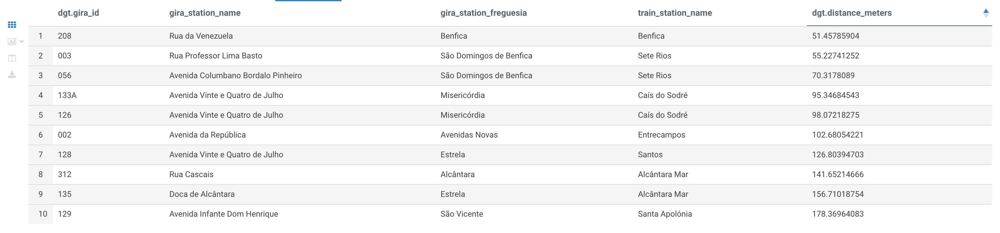
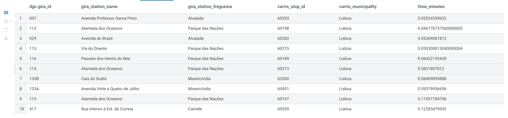
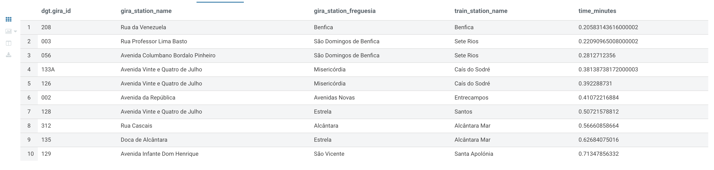
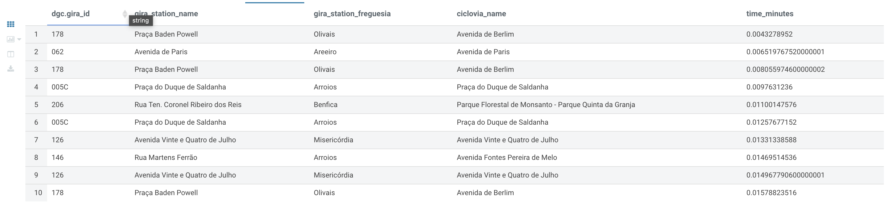
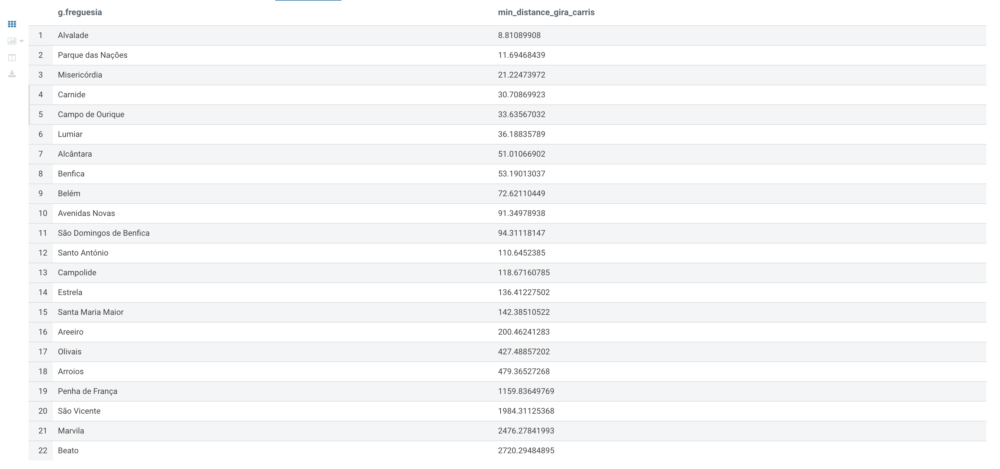
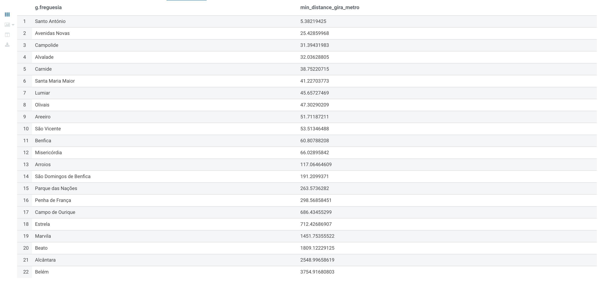
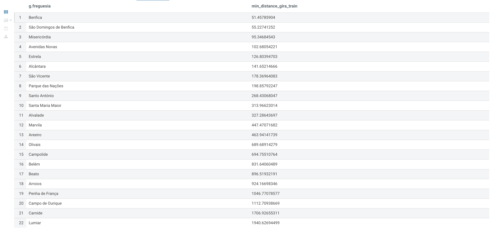

# Gira Bikes Lisbon

Um estudo sobre a integração das estações de bicicletas Gira com a rede de transportes públicos de Lisboa, incluindo ciclovias, paragens de autocarro e estações de Metro e Comboios.

A ideia principal será saber se as estações GIRA se encontram integradas, podem
ajudar a complementar, a rede de transportes públicos já existentes, fazendo alguns
estudos sobre a distância e tempo entre as estações GIRA e as ciclovias, estações
de autocarro, Metro e Comboios.

## Contexto

Trabalho realizado para a disciplina de Bases de Dados Distribuídas Avançadas no [Mestrado em Ciência de Dados](https://iscte-iul.pt/curso/codigo/0329/mestrado-ciencia-de-dados) do ISCTE - Instituto Universitário de Lisboa.

No contexto da questão de integração das estações de bicicletas Gira com a rede
de transportes públicos de Lisboa, lidamos com grandes volumes de dados que
podem aumentar a cada momento, visto que as estações de transportes públicos e
as ciclovias podem sempre vir a ser alargadas no futuro.

Dada esta premissa, decidimos utilizar a stack Hadoop baseada em contentores
Docker, referenciados no projeto docker-hadoop-hive-parquet e no artigo &quot;Making
big moves in Big Data with Hadoop, Hive, Parquet, Hue and Docker&quot;. Confiamos ser a
escolha certa pois o Hadoop permite trabalhar com armazenamento distribuído e um
grande volume de dados, mais ainda quando os nossos dados podem sofrer alterações 
de tamanho e génese ao longo do tempo.

De seguida, como queremos estudar a ligação entre as redes GIRA e a rede de
transportes públicos de Lisboa através da distância e tempo entre as mesmas,
precisamos de calcular as distâncias entre os nossos datasets. Este cálculo foi
efectuado a partir da base de dados Postgres com PostGIS. O postGIS foi utilizado
uma vez que possibilita estudar dados com coordenadas geográficas e dados
espaciais de dados relacionais, que é o nosso caso através das coordenadas de longitude e latitude,
e relacionar os nossos datasets dessa forma, o que para nós o torna mais apelativo que o MySQL.

Tendo os dados em Hadoop, e com as distâncias já calculadas, o passo seguinte é
fazer uso do Hive. O Hive, na nossa opinião, é uma óptima opção uma vez que
facilita a consulta dos nossos dados presentes em HDFS (Hadoop Distributed File
Systems) através de queries do tipo SQL. Assim, temos acesso à nossa informação
de forma a poder estudá-la para retirar conclusões sobre o objectivo do trabalho.

Entre o Hive e o HDFS, passamos pelo MapReduce e o YARN, presentes no
Hadoop. O MapReduce é importante porque é ideal para tarefas de processamento
intensivo, o que nos ajuda nos cálculos dos nossos queries de conhecer as
distâncias entre as estações GIRA e as outras estações de transportes e pontos de
ciclovias e o YARN, por sua vez, gere os recursos do Hadoop e permite que a
aplicação MapReduce seja executada de forma mais eficiente.

Por fim, o uso do Hue tornou-se importante pois é um interface user-friendly 
que simplifica o processo de consulta e interacção com os dados. 
Através do Hue conseguimos interagir com o Haddop, HDFS e Hive de forma mais simples
e ainda possibilitou a visualização dos queries em tabelas e gráficos, o que é 
uma excelente ferramenta para retirarmos as nossas conclusões e respondermos à questão final
de se a integração da GIRA na rede de transportes públicos em Lisboa é um sucesso.

# 1) Preparação dos Datasets

Para este estudo ser desenvolvido, foi necessário utilizar datasets de diferentes fontes, tais como:

1) [Dados.gov](https://dados.gov.pt/pt/) - Plataforma aberta para dados públicos portugueses.
   - [GIRA - Bicicletas de Lisboa](https://dados.gov.pt/pt/datasets/gira-bicicletas-de-lisboa/): Dados sobre as estações Gira, incluindo localização, estado e capacidade.
2) [Geodados CML](https://geodados-cml.hub.arcgis.com/) - Plataforma de dados abertos georreferenciados da Câmara Municipal de Lisboa.
   - [POI Transportes](https://geodados-cml.hub.arcgis.com/maps/4933d8f832474ad2bff558cae59c5207/about) - Serviço de mapa com indicação das principais estações de transportes, interfaces fluviais, elevadores e ascensores, postos de carregamento Mobi E de Lisboa, Zonas de Emissões Reduzidas.
     - [Estações de Comboio](https://geodados-cml.hub.arcgis.com/datasets/CML::poitransportes?layer=0): Dados sobre as estações de comboio, incluindo localização e nome.
     - [Estações de Metro](https://geodados-cml.hub.arcgis.com/datasets/CML::poitransportes?layer=1): Dados sobre as estações de metro, incluindo localização e nome.
   - [POI Mobilidade](https://geodados-cml.hub.arcgis.com/maps/440b7424a6284e0b9bf11179b95bf8d1/about) - Serviço de mapa de área de zona de mobilidade em Lisboa.
     - [Rede Ciclável](https://geodados-cml.hub.arcgis.com/datasets/CML::ciclovias-2/explore?layer=0): Dados sobre as ciclovias, incluindo localização e nome.
3) [Carris Metropolitana API](https://github.com/carrismetropolitana/api) - Um serviço de código aberto que fornece informações de rede no formato JSON ou Protocol Buffers. Este serviço lê e converte o arquivo GTFS oficial da Carris Metropolitana.
   - [Paragens de Autocarro](https://github.com/carrismetropolitana/api?tab=readme-ov-file#stops): Fornece informações estáticas para todas as paragens de autocarros Carris, bem como linhas, rotas e padrões associados que cada paragem usa.


## 1.1) Ferramentas Auxiliares

Para facilitar a importação dos datasets e posterior preparação dos dados, foi necessário utilizar uma base de dados Postgres com [PostGIS](https://postgis.net/).

Essa base de dados foi criada num contentor Docker, para facilitar a sua execução e utilização, a qual pode ser encontrada na pasta `postgres`.

Para executar o contentor Docker, basta entrar na pasta `postgres` e executar o comando:

```sh
docker compose up -d
```

A base de dados Postgres vai possibilitar a importação de todos os datasets, de diferentes fontes, formatos e estruturas, para um único formato. 

Posteriormente, com o auxílio da extensão PostGIS, será executado o cálculo de distâncias entre os pontos de interesse, e a posterior exportação dos dados para arquivos CSV.

## 1.2) Importação dos Datasets

Os datasets foram baixados das fontes acima e armazenados na pasta `dataset`, sendo cada um deles:

- [ciclovias.geojson](dataset/ciclovias.geojson) - Dados sobre as ciclovias de Lisboa.
- [estacoes-comboios.csv](dataset/estacoes-comboios.csv) - Dados sobre as estações de comboio de Lisboa.
- [estacoes-gira.csv](dataset/estacoes-gira.csv) - Dados sobre as estações Gira de Lisboa.
- [estacoes-metro.csv](dataset/estacoes-metro.csv) - Dados sobre as estações de metro de Lisboa.

> Para executar os scripts abaixo, é necessário estar no diretório `dataset`.

Os dados das paragens de autocarro foram obtidos através da API REST da Carris Metropolitana e inseridos diretamente na base de dados Postgres, ao executar o script python:

```sh
python3 import-carris-stops.py
```

Todos os outros ficheiros CSV e GeoJSON foram importados para a base de dados Postgres, ao executar os respetivos scripts python:

**Extrair ciclovias do GeoJSON para CSV:**
```sh
python3 extract-ciclovias-geojson.py
```

**Importar ciclovias do CSV para Postgres:**
```sh
python3 import-ciclovias.py
```

**Importar estações Gira do CSV para Postgres:**
```sh
python3 import-gira-stations.py
```

**Importar estações de Metro do CSV para Postgres:**
```sh
python3 import-metro-stations.py
```

**Importar estações de Comboio do CSV para Postgres:**
```sh
python3 import-train-stations.py
```

No final deste processo, todos os dados dos datasets foram importados para a base de dados Postgres, e estão prontos a ser utilizados. A imagem abaixo resume o relacionamento entre os dados importados.


## 1.3) Cálculo de Distâncias

Uma vez que os dados estão importados na base de dados Postgres, é necessário calcular a distância entre os pontos de interesse.

A imagem abaixo ilustra o cálculo que vai ser preciso fazer para obter a distância - em metros - entre as estações Gira e os pontos de transporte público.


> Para executar os scripts abaixo, é necessário estar no diretório `dataset`.

Para calcular as distâncias entre as estações Gira e os pontos de transporte público, foi criado um script python que deve ser executado como no exemplo:

```sh
python3 calculate-distances.py
```

O script acima vai criar tabelas de distâncias no Postgres e calcular a distância em metros entre as estações Gira e todos os outros pontos de transportes públicos.

## 1.4) Exportação dos Dados para ficheiros CSV

Uma vez que todos os dados estão importados e as distâncias calculadas, é necessário exportar todos os dados para arquivos CSV, para que possam ser importados para o Hadoop.

> Para executar os scripts abaixo, é necessário estar no diretório `exported`.

Para exportar todos os dados da base de dados Postgres para arquivos CSV, foi criado um script python que deve ser executado como no exemplo:

```sh
python3 export-postgres-to-csv.py
```

No final deste processo, todos os dados importados e calculados na base de dados Postgres foram exportados para arquivos CSV, e estão prontos a ser importados para o Hadoop.

A imagem abaixo ilustra o processo de importação e preparação dos datasets:


# 2) Hadoop

A stack Hadoop utilizada neste trabalho será baseada em contentores Docker, referenciados no projeto [docker-hadoop-hive-parquet](https://github.com/tech4242/docker-hadoop-hive-parquet) e no artigo "[Making big moves in Big Data with Hadoop, Hive, Parquet, Hue and Docker](https://towardsdatascience.com/making-big-moves-in-big-data-with-hadoop-hive-parquet-hue-and-docker-320a52ca175)".


## 2.1) Aceder ao Hue e criar user Admin

O primeiro passo é aceder ao Hue, que é uma interface gráfica para o Hadoop, e criar um user Admin - sugestão usada no escopo deste trabalho.

Abrir http://localhost:8888/ e criar um user `admin` com password `admin`.

## 2.2) Copiar datasets para o HDFS com comandos Docker

**Entrar no diretório `hadoop`**

```shell
cd hadoop
```

**Criar diretório `/datasets` no HDFS**

```shell
docker exec hadoop-namenode-1 /bin/bash hdfs dfs -mkdir /datasets
```

**Copiar datasets finais para o contentor docker**

```shell
docker cp ../dataset/exported/ hadoop-namenode-1:/
```

**Inserir os datasets no sistema de ficheiros do Hadoop (HDFS)**

```shell
docker exec hadoop-namenode-1 /bin/bash hdfs dfs -put /exported /datasets
```
A imagem abaixo ilustra o que acontece ao executar os comandos acima.


### 2.2.1) Alternativa: Copiar datasets para o HDFS com Hue

Em alternativa, o upload dos datasets para o HDFS pode ser feito através da interface gráfica do Hue, que no caso deste trabalho está disponível em http://localhost:8888/.

A imagem abaixo ilustra o que acontece ao fazer o upload dos datasets para o HDFS através do Hue.


## 2.3) Criar tabelas no Hive com Hue

Vamos assumir que temos criada uma Base de dados chamada `default`.

Além disso, vamos assumir que os arquivos CSV estarão presentes no path `/datasets/exported/`, conforme executado no passo 2.2.

```sql
CREATE TABLE gira_stations (
    object_id STRING,
    id_p STRING,
    id_c INT,
    cod_via INT,
    nome_rua STRING,
    ponto_referencia STRING,
    freguesia STRING,
    situacao STRING,
    implantacao STRING,
    global_id STRING,
    lon DOUBLE,
    lat DOUBLE,
    location STRING
)
ROW FORMAT DELIMITED
FIELDS TERMINATED BY ','
STORED AS TEXTFILE
TBLPROPERTIES ("skip.header.line.count"="1");

LOAD DATA INPATH '/datasets/exported/gira_stations.csv' INTO TABLE gira_stations;
```

```sql
CREATE TABLE metro_stations (
    object_id INT,
    cod_sig INT,
    id_tipo INT,
    nome STRING,
    situacao STRING,
    linha STRING,
    global_id STRING,
    lon DOUBLE,
    lat DOUBLE,
    location STRING
)
ROW FORMAT DELIMITED
FIELDS TERMINATED BY ','
STORED AS TEXTFILE
TBLPROPERTIES ("skip.header.line.count"="1");

LOAD DATA INPATH '/datasets/exported/metro_stations.csv' INTO TABLE metro_stations;
```

```sql
CREATE TABLE train_stations (
    object_id INT,
    cod_sig INT,
    id_tipo INT,
    id INT,
    nome STRING,
    global_id STRING,
    lon DOUBLE,
    lat DOUBLE,
    location STRING
)
ROW FORMAT DELIMITED
FIELDS TERMINATED BY ','
STORED AS TEXTFILE
TBLPROPERTIES ("skip.header.line.count"="1");

LOAD DATA INPATH '/datasets/exported/train_stations.csv' INTO TABLE train_stations;
```

```sql
CREATE TABLE carris_stops (
    id INT,
    district_id INT,
    district_name STRING,
    locality STRING,
    municipality_id INT,
    municipality_name STRING,
    operational_status STRING,
    region_id STRING,
    region_name STRING,
    stop_id INT,
    lat DOUBLE,
    lon DOUBLE,
    location STRING
)
ROW FORMAT DELIMITED
FIELDS TERMINATED BY ','
STORED AS TEXTFILE
TBLPROPERTIES ("skip.header.line.count"="1");

LOAD DATA INPATH '/datasets/exported/carris_stops.csv' INTO TABLE carris_stops;
```

```sql
CREATE TABLE distances_gira_metro (
    gira_id STRING,
    gira_nome_rua STRING,
    gira_freguesia STRING,
    metro_id INT,
    metro_nome STRING,
    distance_meters DOUBLE
)
ROW FORMAT DELIMITED
FIELDS TERMINATED BY ','
STORED AS TEXTFILE
TBLPROPERTIES ("skip.header.line.count"="1");

LOAD DATA INPATH '/datasets/exported/distances_gira_metro.csv' INTO TABLE distances_gira_metro;
```

```sql
CREATE TABLE distances_gira_stops (
    gira_id STRING,
    gira_nome_rua STRING,
    gira_freguesia STRING,
    stops_id INT,
    stop_municipality_name STRING,
    distance_meters DOUBLE
)
ROW FORMAT DELIMITED
FIELDS TERMINATED BY ','
STORED AS TEXTFILE
TBLPROPERTIES ("skip.header.line.count"="1");

LOAD DATA INPATH '/datasets/exported/distances_gira_stops.csv' INTO TABLE distances_gira_stops;
```

```sql
CREATE TABLE distances_gira_train (
    gira_id STRING,
    gira_nome_rua STRING,
    gira_freguesia STRING,
    train_id INT,
    train_nome STRING,
    distance_meters DOUBLE
)
ROW FORMAT DELIMITED
FIELDS TERMINATED BY ','
STORED AS TEXTFILE
TBLPROPERTIES ("skip.header.line.count"="1");

LOAD DATA INPATH '/datasets/exported/distances_gira_train.csv' INTO TABLE distances_gira_train;
```

```sql
CREATE TABLE ciclovias_pontos (
    ciclovia_id STRING,
    lat DOUBLE,
    lon DOUBLE,
    location STRING
)
ROW FORMAT DELIMITED
FIELDS TERMINATED BY ','
STORED AS TEXTFILE
TBLPROPERTIES ("skip.header.line.count"="1");

LOAD DATA INPATH '/datasets/exported/ciclovias_pontos.csv' INTO TABLE ciclovias_pontos;
```

```sql
CREATE TABLE ciclovias (
    ciclovia_id STRING,
    objectid STRING,
    cod_sig STRING,
    cod_via STRING,
    cod_ciclovia STRING,
    designacao STRING,
    nome_projeto STRING,
    hierarquia STRING,
    eixo STRING,
    tipologia STRING,
    nivel_segregacao STRING,
    tipo_intervencao STRING,
    situacao STRING,
    ano STRING,
    entidade_resp STRING,
    freguesia STRING,
    comprimento DOUBLE,
    comp_km DOUBLE,
    idtipo STRING,
    zonamento STRING,
    globalid STRING
)
ROW FORMAT DELIMITED
FIELDS TERMINATED BY ','
STORED AS TEXTFILE
TBLPROPERTIES ("skip.header.line.count"="1");

LOAD DATA INPATH '/datasets/exported/ciclovias.csv' INTO TABLE ciclovias;
```

```sql
CREATE TABLE distances_gira_ciclovias_pontos (
    gira_id STRING,
    ciclovia_id STRING,
    distance_meters DOUBLE
)
ROW FORMAT DELIMITED
FIELDS TERMINATED BY ','
STORED AS TEXTFILE
TBLPROPERTIES ("skip.header.line.count"="1");

LOAD DATA INPATH '/datasets/exported/distances_gira_ciclovias_pontos.csv' INTO TABLE distances_gira_ciclovias_pontos;
```
# 3) Resultados

Como forma a poder responder à pergunta deste trabalho, temos agora de estudar a conexão da rede GIRA de Lisboa com as restantes infraestruturas de transportes públicos, nomeadamente as rede Carris, de Metro e de Comboio e também as ciclovias.

Desse modo, executámos vários queries em Hive na interface Hue.

Os queries que achámos serem explanatórios para a nossa pergunta inicial vão de encontro à distância e tempo entre os nossos datasets.

## 3.1) Executar Queries no Hive

A análise dos dados será feita através de queries no Hive, ao usar HiveQL como linguagem.

A execução das queries pode ser feita diretamente no Hive Server, através do docker, ou através de ferramentas de visualização de dados, como o Hue.

### 3.1.1) Executar Queries no Hive com a interface Hue

A imagem abaixo ilustra a execução de uma query no Hive através do Hue.


No caso acima, a query será executada na interface do Hue, por meio do Query Editor, disponível em http://localhost:8888/.

No passo 1, a query é escrita no editor de queries do Hue e recebe instrução para ser executada.

No passo 2, o Hue executa a query no Hive Server. 

No passo 3, o Hive traduz a query em HiveQL para jobs MapReduce.

Nos passos 4 e 5, o job MapReduce lê os dados do HDFS, processa e consolida os resultados. Neste processo, o YARN fornece os recursos computacionais e gere a execução dos jobs MapReduce.

Por fim, os resultados do job MapReduce são enviados de volta para o Hive, que os apresenta no Hue para o utilizador.

### 3.1.2) Executar Queries no Hive com Docker

A imagem abaixo ilustra a execução de uma query no Hive através do docker, diretamente no Hive Server.


Semelhante ao que acontece no item 3.1.1, a query será executada diretamente no Hive server, por meio do contentor docker.

**Para entrar no contentor do Hive Server:**
```shell
docker exec -it hadoop-hive-server-1 hive
```

No passo 1, a query é escrita e executada no Hive Server.

No passo 2, o Hive traduz a query em HiveQL para jobs MapReduce.

Nos passos 3 e 4, o job MapReduce lê os dados do HDFS, processa e consolida os resultados. Neste processo, o YARN fornece os recursos computacionais e gerencia a execução dos jobs MapReduce.

Por fim, os resultados do job MapReduce são enviados de volta para o Hive, que os apresenta como output para o usuário.

## 3.2) Análise dos Dados

### Distância média GIRA – Infraestruturas

```sql
SELECT
    'Carris' AS infra_structure, AVG(distance_meters) AS avg_distance
FROM distances_gira_stops s
UNION ALL
SELECT
    'Ciclovias', AVG(distance_meters)
FROM distances_gira_ciclovias_pontos
UNION ALL
SELECT
    'Metro', AVG(distance_meters)
FROM distances_gira_metro
UNION ALL
SELECT
    'Train', AVG(distance_meters)
FROM distances_gira_train;
```


### Tempo médio GIRA – Infraestruturas

```sql
SELECT
    'Carris' AS infrastructure, AVG(distance_meters / 250) AS avg_time_bike
FROM distances_gira_stops
UNION ALL
SELECT
    'Ciclovias', AVG(distance_meters / 250)
FROM distances_gira_ciclovias_pontos
UNION ALL
SELECT
    'Metro', AVG(distance_meters / 250)
FROM distances_gira_metro
UNION ALL
SELECT
    'Train', AVG(distance_meters / 250)
FROM distances_gira_train;
```


### 10 Estações GIRA mais próximas das paragens da Carris

```sql
SELECT
    dgc.gira_id,
    g.nome_rua AS gira_station_name,
    g.freguesia AS gira_station_freguesia,
    c.stop_id AS carris_stop_id,
    c.municipality_name AS carris_municipality,
    dgc.distance_meters
FROM distances_gira_stops dgc
JOIN gira_stations g ON dgc.gira_id = g.object_id
JOIN carris_stops c ON dgc.stops_id = c.stop_id
GROUP BY dgc.gira_id, g.nome_rua, g.freguesia, c.stop_id, c.municipality_name, dgc.distance_meters
ORDER BY dgc.distance_meters
LIMIT 10;
```


### 10 Estações GIRA mais próximas das estações de Metro

```sql
SELECT
    dgm.gira_id,
    g.nome_rua AS gira_station_name,
    g.freguesia AS gira_station_freguesia,
    m.nome AS metro_station_name,
    dgm.distance_meters
FROM distances_gira_metro dgm
JOIN gira_stations g ON dgm.gira_id = g.object_id
JOIN metro_stations m ON dgm.metro_id = m.object_id
GROUP BY dgm.gira_id, g.nome_rua, g.freguesia, m.nome, dgm.distance_meters
ORDER BY dgm.distance_meters
LIMIT 10;
```


### 10 Estações GIRA mais próximas das estações de Comboio

```sql
SELECT
    dgt.gira_id,
    g.nome_rua AS gira_station_name,
    g.freguesia AS gira_station_freguesia,
    t.nome AS train_station_name,
    dgt.distance_meters
FROM distances_gira_train dgt
JOIN gira_stations g ON dgt.gira_id = g.object_id
JOIN train_stations t ON dgt.train_id = t.object_id
GROUP BY dgt.gira_id, g.nome_rua, g.freguesia, t.nome, dgt.distance_meters
ORDER BY dgt.distance_meters
LIMIT 10;
```



### 10 Estações GIRA mais próximas das Ciclovias

```sql
SELECT
    dgc.gira_id,
    g.nome_rua AS gira_station_name,
    g.freguesia AS gira_station_freguesia,
    c.designacao AS ciclovia_name,
    dgc.distance_meters
FROM distances_gira_ciclovias_pontos dgc
JOIN gira_stations g ON dgc.gira_id = g.object_id
JOIN ciclovias c ON dgc.ciclovia_id = c.ciclovia_id
GROUP BY dgc.gira_id, g.nome_rua, g.freguesia, c.designacao, dgc.distance_meters
ORDER BY dgc.distance_meters
LIMIT 10;
```


### 10 Estações GIRA com menor tempo para Carris

```sql
SELECT
    dgc.gira_id,
    g.nome_rua AS gira_station_name,
    g.freguesia AS gira_station_freguesia,
    c.stop_id AS carris_stop_id,
    c.municipality_name AS carris_municipality,
    (dgc.distance_meters / 250) AS time_minutes
FROM distances_gira_stops dgc
JOIN gira_stations g ON dgc.gira_id = g.object_id
JOIN carris_stops c ON dgc.stops_id = c.stop_id
GROUP BY dgc.gira_id, g.nome_rua, g.freguesia, c.stop_id, c.municipality_name, dgc.distance_meters
ORDER BY time_minutes
LIMIT 10;
```



### 10 Estações GIRA com menor tempo para Metro

```sql
SELECT
    dgm.gira_id,
    g.nome_rua AS gira_station_name,
    g.freguesia AS gira_station_freguesia,
    m.nome AS metro_station_name,
    (dgm.distance_meters / 250) AS time_minutes
FROM distances_gira_metro dgm
JOIN gira_stations g ON dgm.gira_id = g.object_id
JOIN metro_stations m ON dgm.metro_id = m.object_id
GROUP BY dgm.gira_id, g.nome_rua, g.freguesia, m.nome, dgm.distance_meters
ORDER BY time_minutes
LIMIT 10;
```


### 10 Estações GIRA com menor tempo para Comboio

```sql
SELECT
    dgt.gira_id,
    g.nome_rua AS gira_station_name,
    g.freguesia AS gira_station_freguesia,
    t.nome AS train_station_name,
    (dgt.distance_meters / 250) AS time_minutes
FROM distances_gira_train dgt
JOIN gira_stations g ON dgt.gira_id = g.object_id
JOIN train_stations t ON dgt.train_id = t.object_id
GROUP BY dgt.gira_id, g.nome_rua, g.freguesia, t.nome, dgt.distance_meters
ORDER BY time_minutes
LIMIT 10;
```



### 10 Estações GIRA com menor tempo para Ciclovias

```sql
SELECT
    dgc.gira_id,
    g.nome_rua AS gira_station_name,
    g.freguesia AS gira_station_freguesia,
    c.designacao AS ciclovia_name,
    (dgc.distance_meters / 250) AS time_minutes
FROM distances_gira_ciclovias_pontos dgc
JOIN gira_stations g ON dgc.gira_id = g.object_id
JOIN ciclovias c ON dgc.ciclovia_id = c.ciclovia_id
GROUP BY dgc.gira_id, g.nome_rua, g.freguesia, c.designacao, dgc.distance_meters
ORDER BY time_minutes
LIMIT 10;
```



### Distância mínima GIRA - Carris por Freguesia

```sql
SELECT
    g.freguesia,
    MIN(dgc.distance_meters) AS min_distance_gira_carris
FROM gira_stations g
JOIN distances_gira_stops dgc ON g.object_id = dgc.gira_id
GROUP BY g.freguesia
ORDER BY min_distance_gira_carris ASC;
```



### Distância mínima GIRA - Metro por Freguesia

```sql
SELECT
    g.freguesia,
    MIN(dgm.distance_meters) AS min_distance_gira_metro
FROM gira_stations g
JOIN distances_gira_metro dgm ON g.object_id = dgm.gira_id
GROUP BY g.freguesia
ORDER BY min_distance_gira_metro ASC;
```



### Distância mínima GIRA - Comboio por Freguesia

```sql
SELECT
    g.freguesia,
    MIN(dgt.distance_meters) AS min_distance_gira_train
FROM gira_stations g
JOIN distances_gira_train dgt ON g.object_id = dgt.gira_id
GROUP BY g.freguesia
ORDER BY min_distance_gira_train ASC;
```



### Distância mínima GIRA - Ciclovias por Freguesia

```sql
SELECT
    g.freguesia,
    AVG(dcp.distance_meters) AS avg_distance_gira_ciclovias
FROM gira_stations g
JOIN distances_gira_ciclovias_pontos dcp ON g.object_id = dcp.gira_id
GROUP BY g.freguesia
ORDER BY avg_distance_gira_ciclovias ASC;
```


# 4) Conclusão

Com base nos resultados obtidos, podemos concluir que a rede GIRA se encontra bem integrada na rede de transportes públicos e ciclovias do concelho de Lisboa.

Em média, qualquer estação de metro, comboio ou ciclovia encontra-se a cerca de 4km de distância de uma estação GIRA, que a uma velocidade média de 15km/h percorrida numa bicicleta Gira se tornam cerca de 17 minutos.

No que toca à distância mínima, há 10 estações GIRA que se encontram a 30 metros ou menos de uma estação de autocarro, a 50 metros ou menos de uma estação de metro, a 200 metros ou menos de uma estação de comboio e a 4 metros ou menos de uma ciclovia.

Todas as distâncias referidas anteriormente, refletem-se num tempo percorrido inferior a 1 minuto numa Gira a 15km/h.

Por fim, observando de forma mais geral, não por estação de GIRA mas por freguesias do concelho de Lisboa, 18 das 22 freguesias têm uma estação de autocarro a menos de 500 metros de estações GIRA e 16 freguesias apresentam uma estação de metro a menos de 300 metros. Além disso, 18 freguesias demonstram uma estação de comboio a menos de 1 km e todas as 22 freguesias têm uma ciclovia a menos de 300 metros de uma estação GIRA.

Baseados nos dados recolhidos e na pesquisa por nós efectuada, a rede GIRA pode ser considerada um bom complemento para a rede de transportes públicos e ciclovias de Lisboa.
